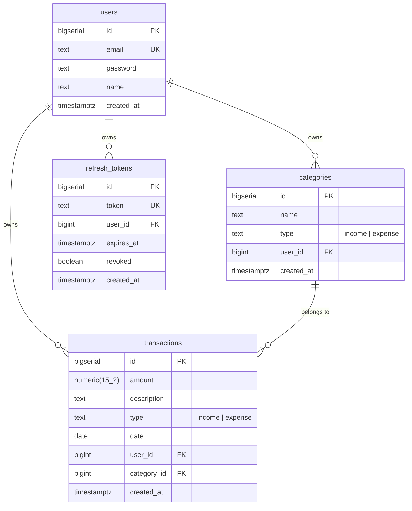
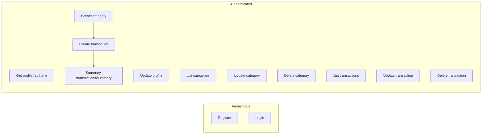

# Finance Tracker API

REST API for personal finance tracking. Built test-first — **128 e2e tests are RED by design**. Your job: make them green.

## Stack

- **Runtime:** Node.js 20+, TypeScript (strict)
- **Framework:** NestJS 11
- **DB:** PostgreSQL + Prisma
- **Auth:** JWT (access) + opaque refresh token (DB, httpOnly cookie)
- **Validation:** Zod
- **Test:** Vitest + supertest
- **Format:** Biome

## Prerequisites

- Node.js 20+
- PostgreSQL running locally
- Two databases: `finance_dev` and `finance_test`

### Create databases

```bash
createdb finance_dev
createdb finance_test
```

## Setup

```bash
npm install
cp .env.example .env
cp .env.example .env.test
# Edit both: set DATABASE_URL to point to the right DB
# .env       → finance_dev
# .env.test  → finance_test
```

## Scripts

| Command | What it does |
|---------|--------------|
| `npm test` | Run all e2e tests |
| `npm run test:watch` | Vitest watch mode |
| `npm run build` | Build with NestJS CLI |
| `npm run start:dev` | Dev server with SWC |
| `npm run db:migrate` | Prisma migrate dev |
| `npm run db:generate` | Prisma generate client |
| `npm run typecheck` | tsc --noEmit |
| `npm run lint` | Biome check |

## Project structure

```
.
├── docs/api/                   # OpenAPI spec
│   ├── openapi.yaml
│   ├── common/
│   │   ├── schemas.yaml
│   │   └── responses.yaml
│   ├── auth/paths.yaml
│   ├── users/paths.yaml
│   ├── categories/paths.yaml
│   ├── transactions/paths.yaml
│   └── summary/paths.yaml
├── prisma/
│   └── schema.prisma           # ← DB schema (fill this in)
├── src/                        # NestJS app (implement here)
│   └── ...
└── tests/
    └── e2e/
        ├── helpers.ts          # API-based seeders
        ├── auth.test.ts        # 28 tests
        ├── users.test.ts       # 12 tests
        ├── categories.test.ts  # 16 tests
        ├── transactions.test.ts# 32 tests
        ├── summary.test.ts     # 10 tests
        └── integration.test.ts # 5 flows
```

## Entity-relationship diagram



## Use cases



## TDD workflow

1. Run `npm test` — all 128 tests fail (routes don't exist yet).
2. Pick the simplest test, e.g. `auth.test.ts` → "POST /auth/register returns 201".
3. Write the Prisma schema in `prisma/schema.prisma`.
4. Run `npm run db:migrate` to apply.
5. Run `npm run db:generate` to generate typed Prisma client + TypedSQL.
6. Implement using **TypedSQL first, Typed Client as fallback**:
   - DTO (Zod schema)
   - Service (TypedSQL queries in `prisma/sql/*.sql`, Typed Client for dynamic filters)
   - Controller (HTTP layer)
   - Module (wire everything)
7. Mount in `app.module.ts`.
8. Run `npm test` — that test green, others still red.
9. Repeat.

### Prisma typed queries

**Default: TypedSQL** — write SQL in `prisma/sql/*.sql`, get type-safe queries automatically.
**Fallback: Typed Client** — only for dynamic queries (runtime-determined filters/columns).

#### 1. TypedSQL (preferred)

Write SQL in `prisma/sql/*.sql` files with type-safe parameters:

```sql
-- prisma/sql/getTransactionsByDateRange.sql
-- @param {Int} $1:userId
-- @param {DateTime} $2:from
-- @param {DateTime} $3:to
SELECT t.id, t.amount, t.description, t.type, t.date,
       c.id as "categoryId", c.name as "categoryName"
FROM transactions t
JOIN categories c ON t.category_id = c.id
WHERE t.user_id = $1
  AND t.date >= $2
  AND t.date <= $3
ORDER BY t.date DESC
```

Use in TypeScript:

```typescript
import { getTransactionsByDateRange } from './generated/prisma/sql'

const txns = await prisma.$queryRawTyped(
  getTransactionsByDateRange(userId, fromDate, toDate)
)
```

#### 2. Typed Client (fallback for dynamic queries)

Only use when the query is truly dynamic (columns/where determined at runtime):

```typescript
// Dynamic filter — columns cannot be determined in static SQL
const where: Prisma.TransactionWhereInput = {}
if (type) where.type = type
if (categoryId) where.categoryId = categoryId

const txns = await prisma.transaction.findMany({
  where,
  include: { category: true },
  skip: (page - 1) * limit,
  take: limit,
})
```

Generated client output: `src/generated/prisma/` (auto-generated, do not edit).

## API spec

All requests/responses are JSON. Auth uses `Authorization: Bearer <token>` (JWT) or `refresh_token` cookie.

**Full OpenAPI spec:** [`docs/api/openapi.yaml`](docs/api/openapi.yaml)

| Endpoint file | Endpoints |
|---------------|-----------|
| [`docs/api/auth/paths.yaml`](docs/api/auth/paths.yaml) | register, login, rotate, logout, me |
| [`docs/api/users/paths.yaml`](docs/api/users/paths.yaml) | get user, update user |
| [`docs/api/categories/paths.yaml`](docs/api/categories/paths.yaml) | CRUD categories |
| [`docs/api/transactions/paths.yaml`](docs/api/transactions/paths.yaml) | CRUD transactions, filters, pagination |
| [`docs/api/summary/paths.yaml`](docs/api/summary/paths.yaml) | transaction summary |

**Shared schemas:** [`docs/api/common/schemas.yaml`](docs/api/common/schemas.yaml)
**Error responses:** [`docs/api/common/responses.yaml`](docs/api/common/responses.yaml)

### Response envelope

```json
// Success
{ "message": "Login successful.", "requestId": "req_abc123", "data": { ... } }

// Success with pagination
{ "message": "Transactions retrieved.", "requestId": "req_abc123", "data": [...], "meta": { "page": 1, "limit": 20, "total": 45, "totalPages": 3 } }

// Error
{ "message": "Invalid email or password.", "requestId": "req_abc123", "code": "auth.credentials.invalid" }

// Validation error
{ "message": "Validation failed.", "requestId": "req_abc123", "code": "validation.failed", "error": [{ "field": "email", "code": "required", "message": "Required." }] }
```

### Auth flow

```
Register: POST /auth/register
  → hash password (bcrypt)
  → create user
  → create refresh_token (opaque random, 7d expiry)
  → Set-Cookie: refresh_token=<token>; HttpOnly; SameSite=Lax; Path=/auth/rotate,/auth/logout; Max-Age=604800
  → Response: { message, requestId, data: { user, accessToken } }

Login: POST /auth/login
  → verify credentials
  → create refresh_token
  → Set-Cookie: (same)
  → Response: (same)

Rotate: POST /auth/rotate (reads refresh_token from cookie)
  → validate: exists, not revoked, not expired
  → revoke old token
  → create new refresh_token + new accessToken
  → Set-Cookie: refresh_token=<new_token>
  → Response: { message, requestId, data: { accessToken } }

Logout: POST /auth/logout
  → revoke refresh_token
  → Clear-Cookie: refresh_token
  → Response: { message, requestId }

Me: GET /auth/me (Bearer <accessToken>)
  → JwtAuthGuard validates
  → Response: { message, requestId, data: { user } }
```

## Conventions

- **Response wrapper:** `{ message, requestId, data?, meta?, code?, error? }`
- **Invariant:** success → `data` present, `code` absent; error → `code` present, `data` absent
- **snake_case → camelCase:** DB columns snake_case, API responses camelCase
- **Passwords:** bcrypt hashed, never returned in responses
- **Amounts:** `numeric(15,2)` in DB, string in API (exact precision)
- **Tests:** API-based only — `helpers.ts` must not query DB directly
